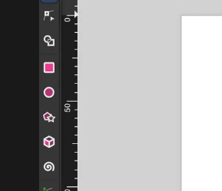
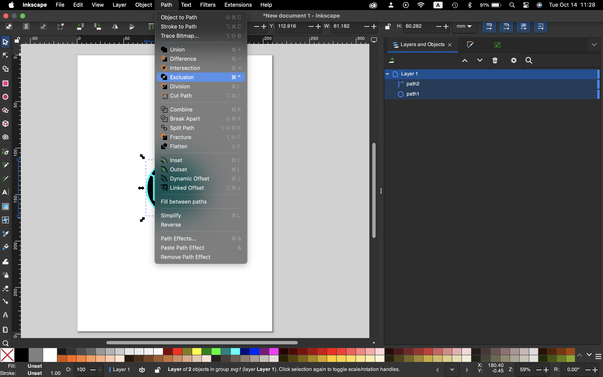
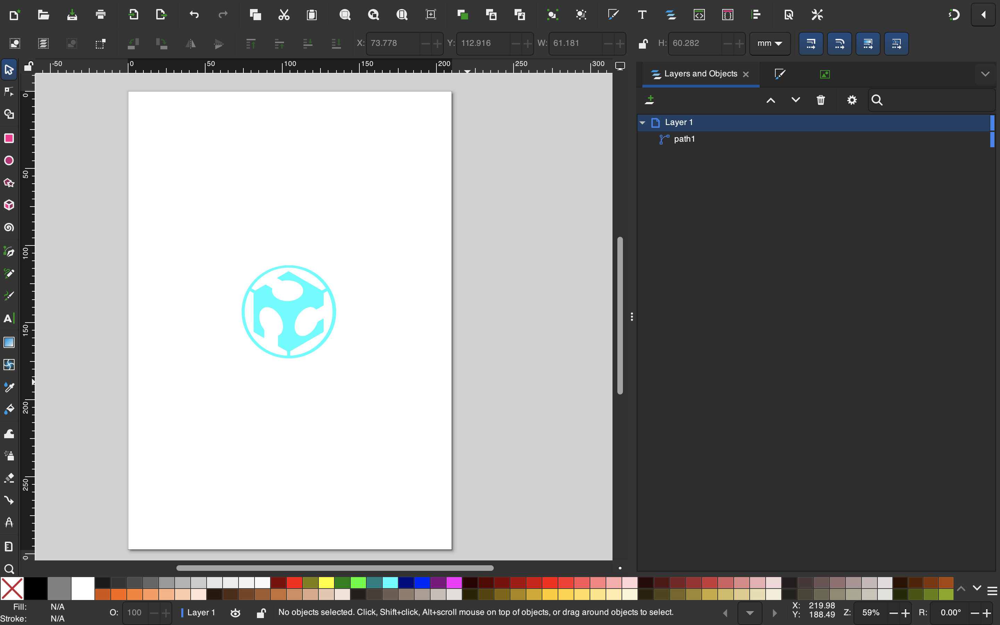
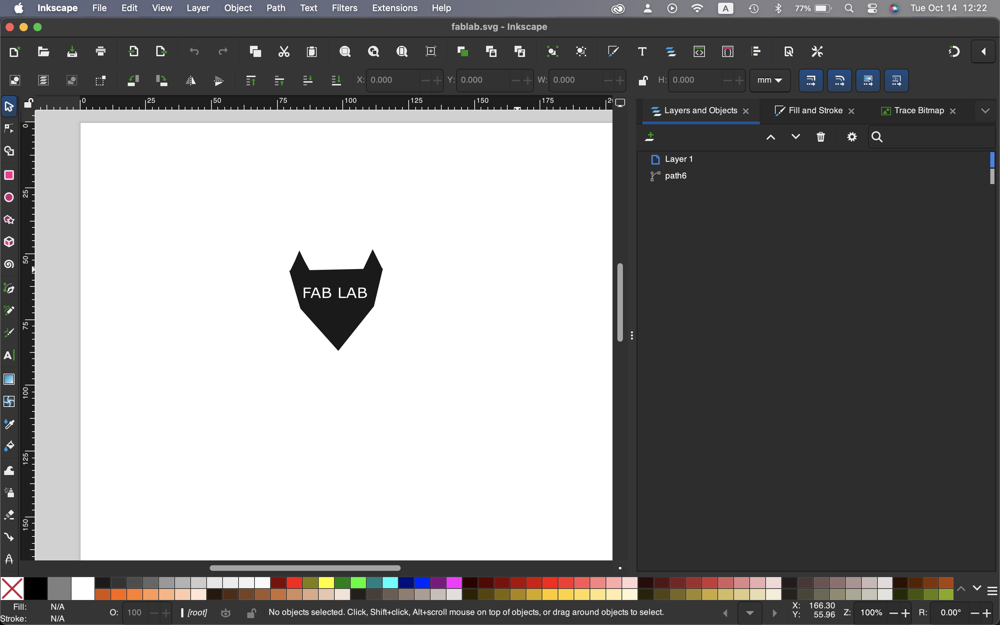
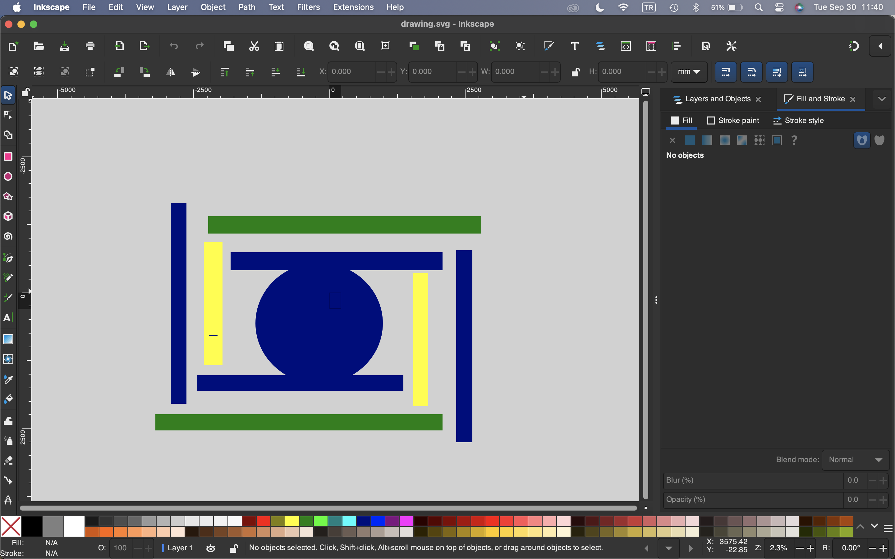

# Inkscape

i first had created a circle. using the shapes tool in the options bar and put the image of the fab academy logo in(the version without the background.

i aligned the logo on to the circle and selected both of them. then i have created the hole of the fab academy logo on the circle using path,execution

final design

[fablogo.svg](Inkscape/fablogo.svg)

i first had created a few triangles . using the shapes tool in the options bar, then i have put in the letterss with the leters tool also on the bar 

then i have combined all of the shapes to create the wolf looking shape then extracted the letters to create the shape with the letters. and have my final design.

[fablab.svg](Inkscape/fablab.svg)

we have created a background design and put in the words Fab Lab on the file and extracted the text from the backround using path and execution

i first had created a few rectangles which i have put in different orders colors and locations to create a modern art looking design. 

we have created a design using inscape and downloaded it 

[drawing.svg](Inkscape/drawing.svg)